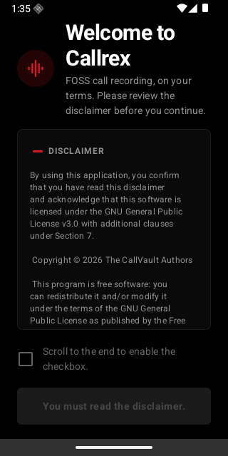
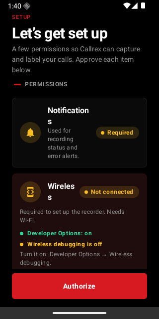
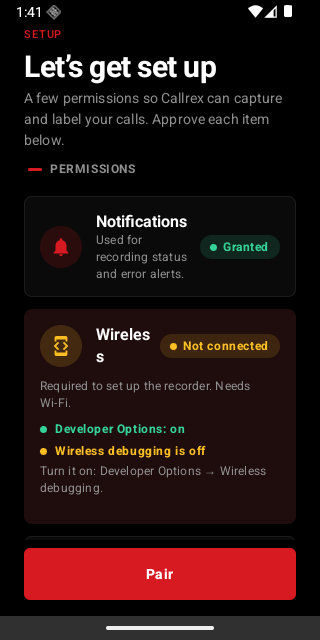

# Callrex

**Record both sides of every call. Transcribe it. Summarize it. All on your phone.**

Callrex is a fully on-device call recorder for Android 11+ that captures **both parties** of
phone calls *and* VoIP calls (WhatsApp, Signal, Telegram), transcribes them with
[whisper.cpp](https://github.com/ggml-org/whisper.cpp), and writes a structured AI summary
with [llama.cpp](https://github.com/ggml-org/llama.cpp) + Gemma. **No cloud, no accounts, no
API keys — your calls never leave your device.**




> Built from the [CallVault](https://github.com/madkongo/CallVault) codebase by the CallVault
> Authors. Rebranded and re-themed as Callrex with a Nothing-style UI. Full license terms apply —
> see [LICENSE](LICENSE) (GPL-3.0, with additional terms under Section 7).

---

## Features

### Recording — both sides, every call type

| Call type | How it's captured | Both parties? |
|---|---|---|
| **PSTN / mobile calls** | Embedded ADB → `mic-voice-comm` audio source | ✅ |
| **VoIP** (WhatsApp, Signal, Telegram, …) | `AudioMixingRule` loopback (remote) + `MIC` (near), stereo L/R | ✅ |

- **No Shizuku, no PC, no cable.** Pairing is done in-app over Wi-Fi (6-digit pairing code,
  wireless debugging). Once paired, recording works after reboots.
- **Stereo separation** — your voice on the left channel, the other party on the right.
  One-tap "which side is you" re-labels *every* past call instantly.
- Per-call or global auto-record, voicemail handling, Wi-Fi-only / always-on policies.
- Export: WAV / Opus / AAC, local folder or Google Drive.

### Transcription — whisper.cpp, 3 models

| Model | Size | Speed (SD888 measured) | Quality |
|---|---|---|---|
| `small q5_1` | 190 MB | ~0.38× real-time — 10 min call ≈ 4 min | fast tier |
| `large-v3-turbo q8_0` *(default)* | 874 MB | ~0.72× real-time — 10 min call ≈ 7 min | **best quality** (WER 7.8%) |
| `turbo q5_0` | 574 MB | ~1.43× real-time — avoid | slowest |

- 13 languages, chunked long-call passes, wrong-script auto-retry, VAD (libparakeet).
- Transcription runs as a foreground WorkManager job with live progress on the home screen.
- The app **measures your own device speed** after the first run and predicts remaining time
  from then on.
- Modes: **After each call** (recommended), automatic daily sweep (default 02:00), or manual.
- ⚠️ Default is **manual** — if your calls never transcribe, check Settings → Transcription mode.

### Summary — Gemma, on-device

After each transcript, a 2.6 GB Gemma model (llama.cpp) produces a structured summary:
**intent, key points, decisions, action items** — each with `[m:ss]` timestamps into the
recording. Deduplication grammar keeps repeated phrases out.

### Design

Nothing-inspired: pure black surfaces, white type, a single red accent, sharp corners, bold
numbered typography. Dark by default (switchable in Settings).



## How it works

```
 ┌─────────────────────────────────────────────────────────────┐
 │  Phone call / VoIP call                                     │
 └──────────────┬──────────────────────────────┬───────────────┘
                │ PSTN                         │ VoIP
                ▼                                ▼
   embedded ADB (shell)              AudioMixingRule reflection
   mic-voice-comm source             loopback-render (far) + MIC (near)
                │                                │
                └──────────┬─────────────────────┘
                           ▼
            stereo → mono  →  Opus/AAC/WAV container
                           │
                           ▼
             Recording catalog (local / Drive)
                           │  (transcription mode fires)
                           ▼
        whisper.cpp (NDK)  →  transcript DB
                           │
                           ▼
        llama.cpp + Gemma  →  structured JSON summary
```

**Why ADB for phone calls:** Android forbids reading the speaker-side audio of a call
directly. Callrex uses the built-in wireless-debugging ADB shell, which can open the
`mic-voice-comm` source that mixes both parties. This is the same technique CallVault's
contributors verified on OnePlus 12 and Galaxy S24 FE.

**Why `AudioMixingRule` for VoIP:** VoIP audio is rendered into the media stream, not the
call stream. Callrex injects a reflective `AudioMixingRule` so the app sees the loopback
(remote) on one channel and the microphone (near) on the other. Note: **VoWiFi/VoLTE
calls are not covered** by the VoIP path.

## Getting started

### Install

Download the release APK (F-Droid / Obtainium / GitHub releases — call recorders cannot be
listed on Google Play). Allow *install unknown apps* for your file manager.

### Setup (one-time, ~10 minutes, needs Wi-Fi)

1. **Allow notifications** — recording status + error alerts.
2. **Pair wireless debugging**:
   - Phone: *Settings → System → Developer options → Wireless debugging → ON*
   - In Callrex: tap **Authorize** on the ADB card, enter the 6-digit pairing code
   - Optional: enable USB debugging too (recording survives Wi-Fi loss)
3. **Wizard**: storage location, auto-record, battery-reliability settings.
4. **Download models** (Wi-Fi): transcription model (~874 MB) and, for summaries,
   Gemma (~2.6 GB). Total ≈ 3.7 GB free space.
5. Make a 2–3 minute test call. Transcript lands in ~1–2 min; summary right after.

### OEM gotchas (read this before "it doesn't record")

- **OnePlus / OPPO / Realme / ColorOS / realme UI:** *Settings → Apps → App management →*
  enable **"Disable system optimization"** for Callrex. (The switch is untranslated.)
  Without it, recording silently fails to start.
- **vivo:** known to break reflective `AudioRecord` — VoIP capture may not work.
- **Every brand:** set Callrex to *Unrestricted* in battery settings and allow it to start
  on boot, or the "I stopped working" state will return after a day or two.

### Verified on

- OnePlus 12 — PSTN + VoIP ✅
- Galaxy S24 FE — PSTN + VoIP ✅
- (Contributions of new device confirmations welcome — open an issue with your model.)

## Building from source

```bash
git clone https://github.com/RYUK8853/callrex.git
cd callrex
git submodule update --init --depth 1   # whisper.cpp + llama.cpp
./gradlew assembleDebug
# → app/build/outputs/apk/debug/app-debug.apk (~90 MB, includes native libs + ggml SIMD)
```

- **Requirements:** JDK 17+, Android SDK platform 36, NDK 27.2.12479018, CMake 3.22.1
- **R8 is deliberately OFF** — the recorder server is launched via `app_process` using a
  string classpath reference, which minification would corrupt.
- See `docs/BUILDING.md` for the full build matrix.

## Privacy

- 100% on-device: audio, transcripts, and summaries never leave the phone.
- No telemetry, no analytics, no accounts.
- Transcripts live in a local Room DB (and optionally Drive if *you* enable sync).
- Recording calls without consent is illegal in some jurisdictions. **You are responsible
  for complying with the laws of your region** — tell the other party the call is being
  recorded where required. India: personal recording is generally permitted, but informing
  the other party is best practice. VoIP (WhatsApp) recordings sit in a TOS gray zone.

## Legal

GPL-3.0 with additional terms under Section 7. Callrex is a derivative of
[CallVault](https://github.com/madkongo/CallVault) © The CallVault Authors — their license
requirements (attribution, warranty disclaimers) are preserved in this repository.
